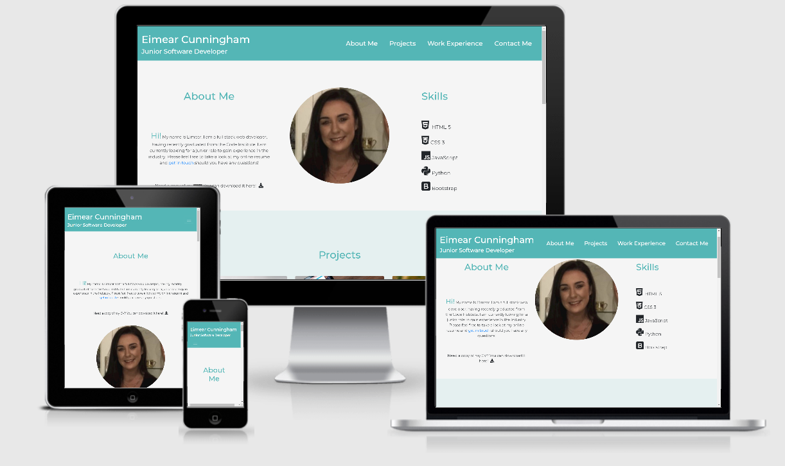

# Eimear Cunningham Resume

Live website: https://eimearcunningham.github.io/Milestone1/

An online resume for interested recruiters to learn more about me.

The main aim of this website is to create an online presence for myself for the purpose of being hired.
 
# UX
 
### Who this website is for:
* This website is for recruiters interested in hiring me.

### What they want to achieve:
* They want to learn more about me, get a feel for my work and potentially contact me.

### This project is the best way to help them achieve these things because:
* The website is easy to navigate and uses a clear layout to display my skills, projects and work experience.

* The Contact Me section is easy to find and provides a form to contact me directly as well as my contact details.

## User Stories:
1. As a recruiter, I want to learn more about this candidate, 
including their skills.
2. As a recruiter, I want to view projects that this candidate 
has worked on to get a feel for their work.
3. As a recruiter, I want to view the candidates relevant work 
experience.
4. As a recruiter, I want to be able to easily see how I can contact 
the candidate should I wish to get in touch.
5. As a recruiter, I want to be able to download the candidate’s 
CV in PDF format.

## Design 
- Color Scheme - I decided on using a blue-green and grey-white color scheme for my Resume Page. This was mainly because blue-green shades are associated with feelings of trust and stability, while grey and white evoke feelings of maturity with a clean finish.
    - #54B6B6 - A "fountain blue" shade was chosen for the header and footer background. This was also used for the text color of each heading on the page.
    - #E5F0F0 - A "zircon" shade of light blue was chosen for the background of 2 out of 4 sections. This tied in nicely with the "fountain blue" shade.
    - #F5F5F5 - A shade of "whitesmoke" was selected for the remaing two section backgrounds.
    - #FAFAFA - A "snow" shade selected for text inside the Header and Footer. This provides a nice contrast between the text and background shades.
    - #E0E0E0 - A "gainsboro" shade selected for the hover state for Navbar links and Footer links. This shade of grey provides a subtle color change when hovering over clickable links. 

- Typography 
    - Google Font "Montserrat" was used for all text on the page. This is a commonly used font that creates feelings of trust. I chose this font for this reason as well as the clean, simple finish which goes with the overall theme of my page.

## Wireframes:
[desktop](https://github.com/EimearCunningham/Milestone1/blob/master/assets/wireframes/desktop.png)

[tablet](https://github.com/EimearCunningham/Milestone1/blob/master/assets/wireframes/tablet.png)

[mobile](https://github.com/EimearCunningham/Milestone1/blob/master/assets/wireframes/mobile.png)

# Features

### Header
* Header Logo - A fixed-top, clickable logo which brings users back to the top of the page, as would be expected.
* Navigation Bar - Also fixed-top, the navigation bar contains links to each section of the page. This means that as the user scrolls through the page they always have to option to get to another section.

### About Me Section 
* Link to Download CV - An easy to see link for the user to download my CV as a PDF.
* Main Image - A professional headshot of myself.
* List of Skills - A list of my skills using Font Awesome Icons and Hover.css to make interactive for the user.

### Projects Section
* Album with Links to Projects - A Bootstrap album with three thumbnails to display my portfolio.

### Work Experience Section
* Timeline with relevant Work Experience - A timeline created using modified code from Bootsnipp.com to display my recent work experience.

### Contact Me Section
* Contact Form - A contact form with requires the user to input their Name, Email address and Message before submitting using the Submit Button.

### Footer
* Contact Information - Displayed directly under the Contact Form, should users wish to contact me directly via phone / email.
* Social Media Links - Links to my Facebook, GitHub and Twitter profiles.
* Link to Download CV - A second link to download my CV in PDF format. This will save the user from going back to the top of the page should they wish to download my CV.

### Features Left to Implement
* Actual project links - As my portfolio grows I will add links to my actual projects, rather than to my GitHub page.
* Form functionality - To be added as I learn backend processes.
* Submit button - To change from "Send" to "Message Sent" when relevent JavaScript has been learned.

# Technologies Used
* HTML5 and CSS3 were the programming languages used for this project.

* [Coolors](https://coolors.co/) - Coolers was used as part of my planning process, to select the color theme for the page.
* [Google Fonts](https://fonts.google.com/) - This project uses "Montserrat" from Google Fonts for all text throughout the page. 
* [Balsamiq](https://balsamiq.com/) - Balsamiq was used to create the wireframes included in this file.

* [JQuery](https://jquery.com/) - JQuery came with Boostrap for any JavaScript needed.
* [Bootstrap 4.4.1](https://getbootstrap.com/) - Bootstrap version 4 was used throughout this project.
* [Popper](https://popper.js.org/) - Popper.js was used with Bootstrap for any JavaScript needed.

* [Bootsnipp](https://bootsnipp.com/) - I used code from Bootsnipp to create the timeline used in the "Work Experience" section of my project. I then modified this code to suit my color scheme and content.
* [Bootstrap Examples](https://getbootstrap.com/docs/4.0/examples/album/) - I used code from Bootstrap examples to create the album in the "Projects" section of this page.
* [Hover.css](https://ianlunn.github.io/Hover/) - This library was used to add hover effects to the navigation bar links, and the list items in my list of skills in the "About Me" section of my page.

* Pexels.com - Pexels provided the three images used in the album inclided in the "Projects" section of my page.
* [Font Awesome](https://fontawesome.com/) - Used for all icons in the project 
* [AmIResponsive](http://ami.responsivedesign.is/) - I used AmIResponsive to generate a picture of how my site will look across different devices.
* [W3C Markup Validation Service](https://validator.w3.org/) - Used to test all HTML code
* [W3C Css Validation Service](https://jigsaw.w3.org/css-validator/) - Used to test all CSS code 

# Testing
This can be found in [testing.md](testing.md)
# Deployment
This project was deployed using GitHub Pages.

## To deploy this page I followed these steps:
1. Go to GitHub.com and log into account.
2. From the list of repositories to the left of the page, select EimearCunningham/Milestone1.
3. Once the repository is open, select the "Settings" button.
4. Scroll down to the "GitHub Pages" section.
5. Select the drop-down box which reads "none".
6. Select the Branch Master option, then save.
7. Refresh the page and then scroll back down to the "GitHub" pages section. Here you will find the link to the deployed site - https://eimearcunningham.github.io/Milestone1/

## To run this project locally: Clone from GitHub
1. Go to the [project repository](https://github.com/EimearCunningham/Milestone1)
2. Above the list of files, select the green "Code" drop-down button.
3. Under "Clone with HTTPS", click the "copy" icon.
4. Open Git Bash.
5. Change the current working directory to the location where you want the cloned directory.
6. Type "git clone", and then paste the URL you copied earlier.
7. Press Enter. Your local clone will be created.

# Credits

## Code
* Code for the album in "Projects" section was obtained from [Bootstrap Examples](https://getbootstrap.com/docs/4.0/examples/album/)
* Code for the timeline in "Experience" section was obtained from [Bootsnip.com](https://bootsnipp.com/snippets/prmge)
## Media
* The main image used in the "About Me" section is my own.
* The three images used in the "Projects" section were obtained from [Pexels.com](https://www.pexels.com/)

## Acknowledgements
* I would like to thank my mentor, Can Sucullu for his help and suggestions throughout this project.

